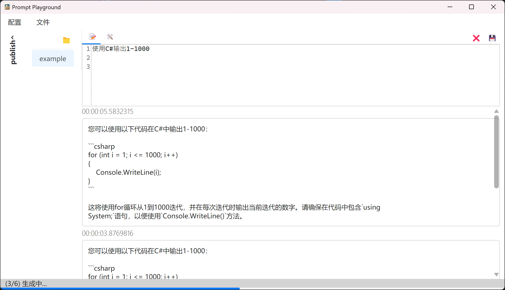

# Prompt Playground

一个简易的Semantic Kernel提示词调试工具。

## 使用方法 🐣

### 下载安装

1. 从Release下载最新的构建好的压缩包, 解压到任意目录。
2. 运行`prompt-playground.exe` 即可。

### 首次使用

首次使用需要先进入配置设置。

点击配置菜单，即可进入配置界面。

目前模型的选择支持:

1. Azure OpenAI ChatCompletion
1. Baidu ERNIE-Bot Turbo
1. Baidu ERNIE-Bot

Max Generate Results 指最大生成结果数量，默认为3。

填写入对应的参数，关闭即可。

### 直接使用

在主界面的提示词框中直接输入提示词，点击生成(Ctrl+G)即可。

### 导入skprompt

点击打开(Ctrl+O)按钮，选择skprompt.txt文件，即可自动导入提示词，同时会导入对于config.json文件。

对于没有config.json文件的skprompt，会自动创建一个默认的config.json文件。

点击输入框上方的Tab，可以切换到config.json编辑界面。

### 导出skprompt

对于skprompt.txt或者config.json文件修改后，点击保存(Ctrl+S)按钮，即可保存到对应的文件。

## 导入Semantic Skill

1. 点击[文件]菜单，选择[打开文件夹]，选择包含Semantic Functions的文件夹
1. 展开侧边栏，即可看到当前文件夹下的所有Semantic Functions
1. 选择对应的 Function ，即可进行编辑运行

## 截图

## 构建 🛠

1. 安装 .NET 7 SDK
2. 下载源码
3. 运行 `dotnet build` 即可

## Roadmap 🚧

https://github.com/xbotter/PromptPlayground/issues/1

## Credits 🙏

- [AvaloniaUI](https://github.com/AvaloniaUI/Avalonia)
- [AvaloniaEdit](https://github.com/AvaloniaUI/AvaloniaEdit)
- [Semantic-Kernel](https://github.com/microsoft/semantic-kernel)
- [semantic-kernel-ERNIE-Bot](https://github.com/custouch/semantic-kernel-ERNIE-Bot)

## License 📃

This project is licensed under the MIT License - see the [LICENSE](LICENSE) file for details
