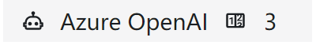
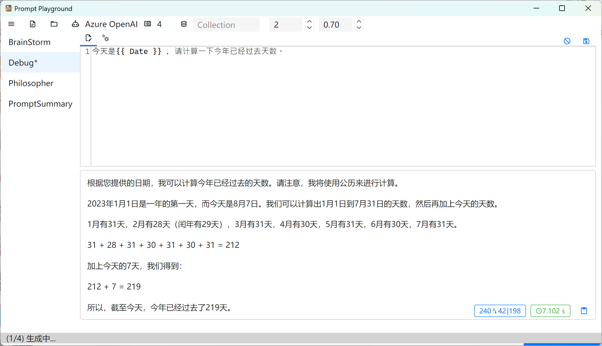

# Prompt Playground

A simple Semantic Kernel prompt debugging tool.

## How to use 🐣

### Download and Install

1. Download the latest installation package from Release.
2. Install and run `prompt-playground.exe`.

### First-time use

You need to enter the configuration settings for the first time.

Click on the configuration in the menu to enter the configuration interface.

The current model selection supports:

1. Azure OpenAI ChatCompletion (gpt-35/gpt-4)
1. OpenAI ChatCompletion
1. Baidu ERNIE-Bot
1. Aliyun DashScope

`Generation quantity` refers to the maximum number of results generated, the default is 3.

Fill in the corresponding parameters and close.

### Direct use

Enter the prompt directly in the prompt box on the main interface, and click `Generate` (Ctrl+G/Ctrl+Enter).

### Import skprompt

Click the `Open File` button on the menu bar, select the skprompt.txt file, and the prompt will be automatically imported, and the corresponding config.json file will be imported at the same time.

For skprompts without a config.json file, a default config.json file will be automatically created.

Click the Tab above the input box to switch to the config.json editing interface.

### Save skprompt

After modifying the skprompt.txt or config.json file, click the Save (Ctrl+S) button to save to the corresponding file.

## Import Semantic Plugin

1. Click on the menu bar, select [Open Folder], and choose the folder containing Semantic Functions
1. Expand the sidebar to see all Semantic Functions in the current folder
1. Select the corresponding Function to edit and run

## Screenshots

## Build 🛠

1. Install .NET 8 SDK
2. Download the source code
3. Run `dotnet build`

## Roadmap 🚧

See [Roadmap](https://github.com/xbotter/PromptPlayground/issues/1)

## Dependencies 📦

- [AvaloniaUI](https://github.com/AvaloniaUI/Avalonia)
- [Semi.Avalonia](https://github.com/irihitech/Semi.Avalonia)
- [AvaloniaEdit](https://github.com/AvaloniaUI/AvaloniaEdit)
- [Icons.Avalonia](https://github.com/Projektanker/Icons.Avalonia)
- [Semantic-Kernel](https://github.com/microsoft/semantic-kernel)
- [semantic-kernel-ERNIE-Bot](https://github.com/custouch/semantic-kernel-ERNIE-Bot)

## License 📃

This project is licensed under the MIT License - see the [LICENSE](LICENSE) file for details

